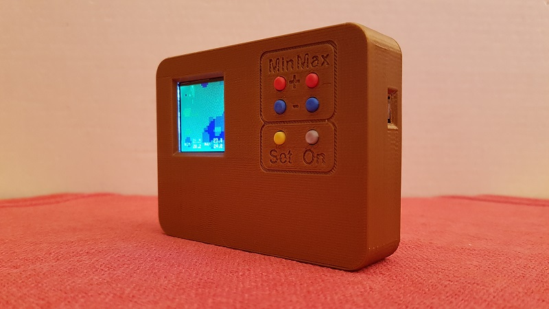

# thermo-cam

Dieses Projekt enthält die Hard- und Softwarekomponenten für eine Eigenbau-Wärmebildkamera mit dem Sensor AMG8833 auf Basis einer ESP8266-12E NodeMCU mit Selbstkosten von etwa 80€.

----------

**Bitte beachten: dieses Projekt ist noch in Entwicklung. Es läuft zwar schon alles, aber an Verbesserungen und Erweiterungen von Hard- und Software wird noch 
gearbeitet.** 

----------

Basierend auf dem Beispiel [thermal\_cam\_interpolate](https://github.com/adafruit/Adafruit_AMG88xx/tree/master/examples/thermal_cam_interpolate "thermal_cam_interpolate") von [adafruit](https://www.adafruit.com/) wurde die Software für die ThermoCam entwickelt. Die Interpolationsfunktion "interpolation.cpp", welche die real 8x8 Bildpixel des Thermosensors auf 32x32 Pixel interpoliert wurde 1:1 von adafruit übernommen.

## Software 

Da der ESP8266 Arduino-kompatibel ist, kann die Software mit allen verfügbaren Arduino-Entwicklungsumgebungen gebaut und geflasht werden.
Dabei kommen folgende Standard-Arduino-Bibliotheken zum Einsatz:

- EEPROM
- SoftwareSerial
- SPI
- Wire

Folgende externe Bibliotheken müssen beschafft und entsprechend den Anleitungen der jeweiligen Entwicklungsumgebungen eingebunden werden:

- [Adafruit\_AMG_88xx\_Library](https://github.com/adafruit/Adafruit_AMG88xx) (Sensoransteuerung)
- [Adafruit\_ESP8266](https://github.com/adafruit/Adafruit_ESP8266) (Funktionen der NodeMCU)
- [Adafruit\_GFX\_Library](https://github.com/adafruit/Adafruit-GFX-Library) (Graik- und Textausgabe)
- [ESP8266WiFi](https://github.com/esp8266/Arduino) (zum stromsparenden Abschalten des WiFi-Teils)
- [OneButton](https://github.com/mathertel/OneButton) (Tasterabfrage)
- [TFT_eSPI](https://github.com/Bodmer/TFT_eSPI) (schnellere LCD-Ansteuerung als von adafruit)
- [UrsAdc](http://bienonline.magix.net/public/esp8266-adc.html) (A/D-Wandlung für Sopnnungsmessung)

## Hardware 

Hier eine Liste der Hauptkomponenten mit Bezugsquellen

- Thermosensor-Breakout [AMG8833](https://www.adafruit.com/product/3538)
- TFT-Display-Breakout [ST7735R](https://www.adafruit.com/product/2088) 
- NodeMCU [ESP8266-12E](https://www.aliexpress.com/item/1pcs-NodeMCU-V3-Lua-WIFI-module-integration-of-ESP8266-extra-memory-32M-Flash-USB-serial-CH340G/32813713134.html)
- 3,7V-Akku [18650](https://www.aliexpress.com/item/2PCS-3-7V-4200mAh-18650-MICKTICK-Battery-lithium-Li-Ion-Rechargeable-Large-Capacity-Batteries-batteria-T6/32803586525.html)
- Akku-Lade- und Schutzschaltung [BMS](https://www.aliexpress.com/item/1S-3-7V-3A-li-ion-BMS-PCM-battery-protection-board-pcm-for-18650-lithium-ion/32673915806.html)
- Step-Up / Step-Down Spannungsregler [3V3](https://www.aliexpress.com/item/mini-2-in-1-DC-DC-Step-Down-Step-Up-Converter-1-8V-5V-to-3/32764847210.html) 
- 6 Stück Kurzhubtaster [9308](https://www.reichelt.com/fr/en/Switches-Tactile/TASTER-9308/3/index.html?ACTION=3&GROUPID=7587&ARTICLE=44532&START=0&OFFSET=16&)
- Gehäuse und Tasterköpfe [ThermoCam](https://www.thingiverse.com/thing:2813276) (müssen selbst gedruckt oder in Auftrag gegeben werden)

Neben einem Stück Lochrasterplatte für die Taster, Kabeln, Widerständen und Kontaktblechstreifen sind noch einige Flachkopf-Schrauben M3x5 und M2,5x5 erforderlich. Ich habe die Löcher von Display und Sensor auf 3mm aufgebohrt und generell M3-Schrauben verwendet. 

Da Schiebeschalter unpraktisch sind und um bei Nichtbenutzung das Gerät nach 5 Minuten abschalten zu können, erfolgt das Schalten der Stromversorgung elektronisch. Die im Schaltplan angegebenen Mosfet-Transistoren sind nur als Beispiel zu sehen. Alle Transistoren mit einem Maximalstrom von 500mA und einer Tresholdspannung kleiner 2V sind verwendbar. 

Da die auf den Boards verwendeten Linearregler für 3,3V eine Spannungsdifferenz zwischen Ein- und Ausgang von mindestens 0,4V - 0,5V benötigen, versagen sie bereits bei der Akku-Nennspannung von 3,7V. Deshalb sorgt der Step-Up / Step-Down-Wandler dafür, daß die Module in einem Bereich der Eingangsspannung von 3,3V bis 5V (beim Laden über USB) konstant mit 3,3V versorgt werden.

Das BMS dient dem Schutz des Akkus gegen Unter- und Überladung und wird (versehen mit Kontaktblechstreifen für den Akku) 

in dem Kanal unter diesem platziert. In das Verbindungskabel vom Akku zur Schaltung sollte eine lösbare Kupplung eingefügt werden, um den Akku von der Schaltung trennen zu können. 

Das Innenleben sieht letztendlich so aus:

## Bedienung

Nach dem Einschalten über den Taster **On** läuft die Kamera im Interpolationsmodus mit automatischer Farbskala-Anpassung. Auf der unteren linken Seite des Displays wird neben "min:" oben die kleinste Temperatur innerhalb des Bildes angezeigt. Darunter in einer Art Schleppzeigerfunktion die kleinste seit dem Start oder Update gemessene Temperatur. Diese wird als Referenz für die Farbe Blau verwendet. Analog werden rechts neben "max:" die jeweiligen Maximalwerte mit der Referenz für Rot angezeigt. Somit paßt die Kamera die Farbskala automatisch an den aktuellen Temperaturbereich an. An der Stelle der höchsten Temperatur im Bild wir ein weißes **+** Zeichen eingeblendet.
Hat man allerdings kurzzeitig einen sehr heißen Punkt im Bild gehabt, erreichen ab dann die niedrigeren Temperaturen nicht mehr den Rot-Pegel was zu einerblau/grün-lastigen Bilddarstellung führt. In diesem Fall kann durch kurzes Drücken der Taste **Set** die Schleppzeigerfunktion auf die aktuellen Bildwerte zurückgesetzt werden. Das Bild zeigt nun wieder das volle Farbspektrum.  

Mit einem längeren Druck auf die **Set**-Taste kann man den Automatik-Modus ausschalten. Die Schleppzeiger-Werte werden nun in Grau dargestellt und können mit den Tasten **Min+**, **Min-**, **Max+** und **Max-** manuell eingestellt werden. Dabei ist keine kleinere Differenz zwischen Min und Max als 5 grd einstellbar, um die Anzeige sinnvoll zu halten.

Ein zweiter längerer Druck auf **Set** schaltet die Interpolation aus. Das hat zwar keinen praktischen Wert, aber es ist interessant zu sehen, wie das Original-Sensorsignal ohne Interpolation aussieht. Mit einem dritten langen Druck auf **Set** wird wieder in den anfänglichen Automatikmodus zurückgeschaltet. 

Ausgeschaltet wird die Kamera durch einen Doppelklick auf **Set**. Im Batteriebetrieb schaltet sich die Kamera nach 5 Minuten ohne Tastenbetätigung automatisch aus, um den Akku zu schonen. Wird die Kamera über ein USB-Kabel versorgt, ist die automatische Abschaltung deaktiviert.  

Die Akkuspannung wird ständig überwacht. Unterhalb von 3,5V erscheint in der rechten oberen Display-Ecke ein gelbes Batteriesymbol als Warnung. Dieses wechselt unterhalb einer Spannung von 3,35V auf Rot und beginnt zu blinken. Sinkt die Spannung unter 3,3V schaltet sich die Kamera automatisch ab.  
 
Ein Doppelklick auf **Min+** zeigt die aktuelle Eingangsspannung der Schaltung, in der Regel also die Akkuspannung, an. Damit kann man die noch verbleibende Laufzeit abschätzen.  Bei einer Stromaufnahme der Kamera von ca. 120mA reicht ein voll geladener Akku für mindestens 30 Stunden. Ein erneuter Doppelklick auf **Min+** wechselt zur Standardanzeige zurück. Damit sowohl diese Anzeige als auch die Spannungsüberwachung mit genauen Werten arbeiten, empfiehlt sich die Kalibrierung der Spannungsmessung. Dazu wechselt man mit einem Doppelklick auf **Min-** in den Kalibriermodus. Dabei wird die Spannung angezeigt, die der Prozessor meint gemessen zu haben. Die tatsächliche Spannung ist nun am Vin-Pin des ESP8266 mit einem genauen Voltmeter zu messen und mit dem gemessenen Wert die Anzeige zu korrigieren. Die jeweils blinkende Stelle kann dabei mit den Tasten **Max+** und **Max-** angepaßt werden, die Tasten **Min+** und **Min-** wechseln die Position der blinkenden Stelle. Für größere Änderungen können die Tasten **Max+** und **Max-** nach dem Drücken auch gedrückt gehalten werden. Die Werte beginnen dann schnell durchzulaufen.  
Soll die Eingabe gespeichert werden, ist die **Set**-Taste lange gedrückt zu halten. Die Kamera wechselt nach dem Speichern wieder in den normalen Anzeigemodus. Soll der Kalibriermodus ohne Speichern des Wertes verlassen werden, geschieht das über einen erneuten Doppelklick auf die **Min+**.